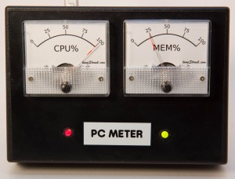

# PC Meter

A Windows system tray application that sends CPU and memory utilization to a custom Arduino-based analog meter device.



## Overview

PC Meter consists of two parts:

1. **Windows app** (`PcMeter/`) — a .NET 8 WPF tray application that reads CPU% and memory% every 500ms and sends the values to the meter device over a serial port.
2. **Arduino firmware** (`arduino/`) — runs on an Arduino Leonardo, receives the data over serial, and drives two analog panel meters with green/red LEDs.

The meter hardware uses analog panel meters (VU-style gauges) driven by PWM output from the Arduino. Each meter has a green LED that switches to red when utilization exceeds 80%.

## Windows Application

### Requirements

- Windows 10/11
- .NET 8 runtime (or SDK to build)
- Arduino-based PC Meter device connected via USB (virtual COM port)

### Build & Run

```
dotnet build PcMeter/PcMeter.csproj
dotnet run --project PcMeter/PcMeter.csproj
```

Or open `PcMeter/PcMeter.csproj` in Visual Studio 2022.

### Usage

The app runs as a system tray icon. Right-click the tray icon to:

- View live **CPU%** and **Memory%**
- **Connect / disconnect** the serial port
- Open **Settings** to choose the COM port
- View the **About** dialog
- **Exit** the application

On first run, go to Settings and select the COM port your Arduino is connected to. The setting is saved to `%APPDATA%\PcMeter\settings.json` and restored on next launch.

The app shows a balloon tip when it successfully connects to the device. If the device is unplugged while running, an error message is shown and the app continues running — reconnect via the tray menu.

### Settings

| Setting | Default | Description |
|---------|---------|-------------|
| COM Port | COM20 | Serial port the Arduino is connected to |

## Arduino Firmware

### Requirements

- Arduino Leonardo (or compatible)
- Arduino IDE 1.8+ or 2.x

### Hardware

| Pin | Function |
|-----|----------|
| 11 | CPU meter (PWM) |
| 10 | Memory meter (PWM) |
| 4 | CPU green LED |
| 5 | CPU red LED |
| 2 | Memory green LED |
| 3 | Memory red LED |

### Behavior

- Meters update every 100ms, smoothed using a rolling average of 20 readings for fluid needle movement
- LEDs are green below 80% utilization and switch to red at or above 80%
- On startup, both meters sweep to 100% for 2 seconds as a self-test
- If no serial data is received for 2 seconds, a "screensaver" mode activates: needles sweep back and forth until data resumes

## Serial Protocol

The Windows app sends CR-terminated messages at 9600 baud:

```
C{0-100}\r   → CPU percentage
M{0-100}\r   → Memory percentage
```

Both are sent together every 500ms: `C42\rM67\r`

## Project Structure

```
PcMeter/            .NET 8 WPF tray application (current)
PcMeter (legacy)/   .NET Framework 4.8 WinForms app (legacy)
arduino/            Arduino firmware
drawings/           Meter face artwork (SVG + PNG)
```

## License

MIT License — Copyright © 2018-2026 Scott W. Vincent

http://www.swvincent.com/pcmeter
